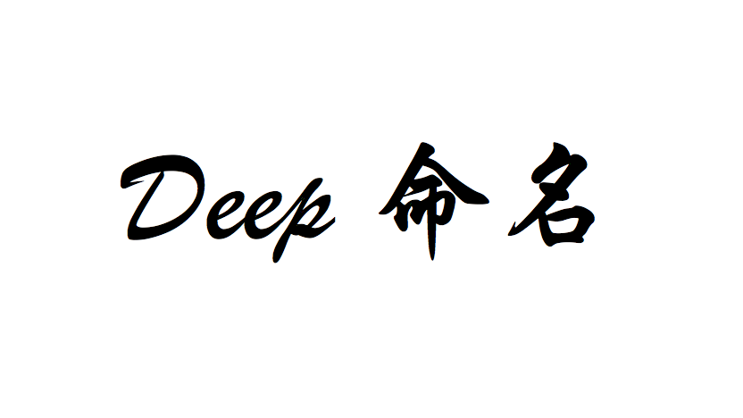
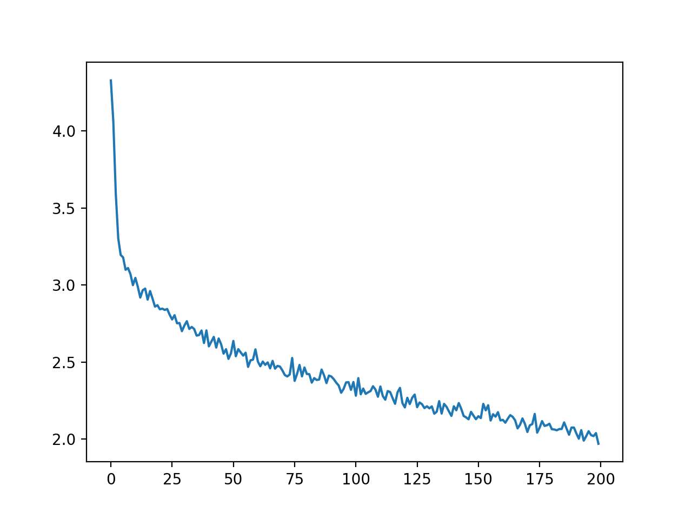

# Japanese Name Generator




A character based neural network model to generate Japanese names in Katakana.  
Both boys name and girls name are supported.

***Keywords:*** Character based text generation, LSTM, PyTorch, Japanese text pre-processing


## Training
### Sample Output

```
0m 28s (5000 5%) 3.3321
0m 52s (10000 10%) 2.5643
1m 21s (15000 15%) 2.3973
1m 48s (20000 20%) 2.2542
2m 15s (25000 25%) 2.3280 
```
### Loss Curve


## Generation
### Sample Output (boys)

```
samples('boys_name', 'カキクケコ')
```
```
boys_name カイチ
boys_name キョウスケ
boys_name クン
boys_name ケン
boys_name コンヤ
```

### Sample Output (girls)

```
samples('girls_name', 'カキクケコ')
```
```
girls_name カナ
girls_name キナ
girls_name クナ
girls_name ケイ
girls_name コウカ
```
## ToDo
- Collect larger data set including Kanji names

## Environment
- Python 3.6
- PyTorch 0.3

## Reference

- Generating Names with a Character-Level RNN
https://pytorch.org/tutorials/intermediate/char_rnn_generation_tutorial.html